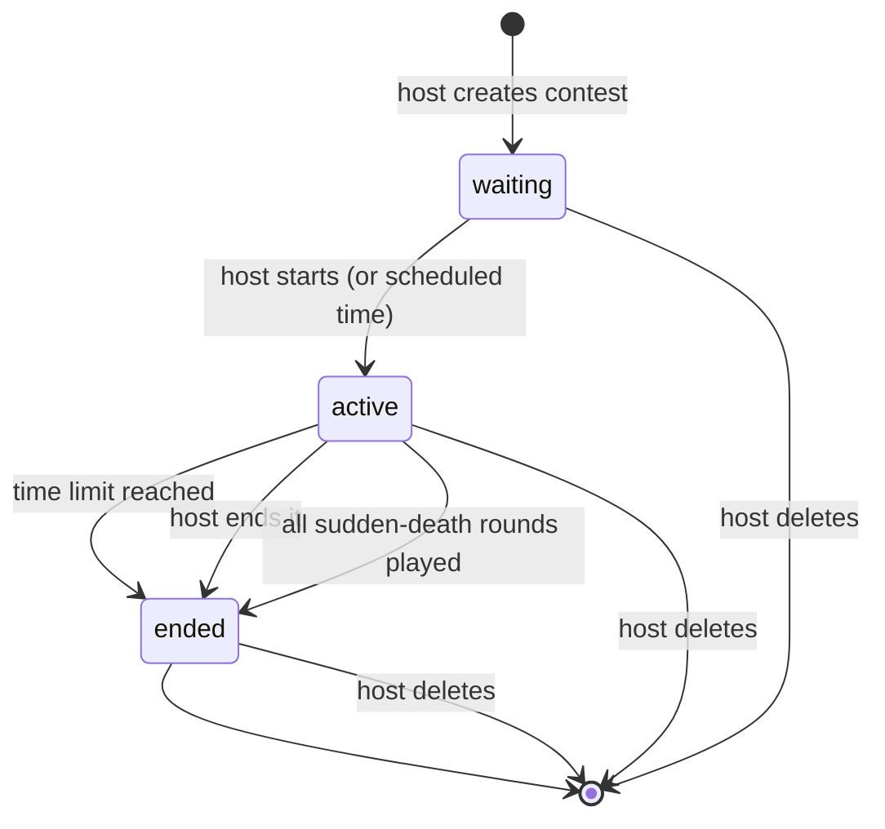
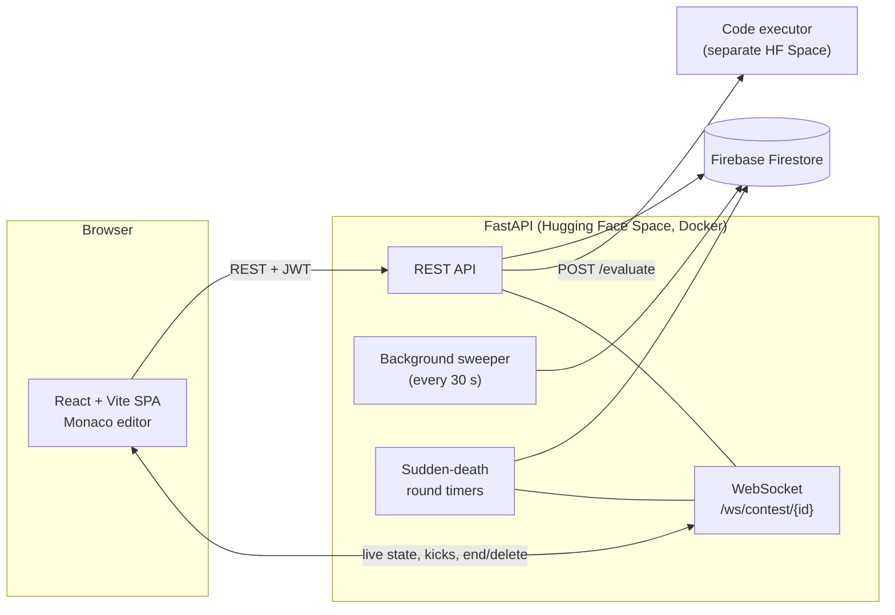

<div align="center">


### A real-time competitive programming arena

Host or join live coding contests, get judged automatically, review what everyone wrote, and watch the standings move as people pass testcases.

[](https://react.dev)
[](https://vitejs.dev)
[](https://fastapi.tiangolo.com)
[](https://firebase.google.com)
[](https://huggingface.co/docs/hub/spaces-sdks-docker)

**[Live demo](https://sanjaymarathi-compicode-arena.hf.space)** · **[Hugging Face Space](https://huggingface.co/spaces/sanjaymarathi/CompiCode-Arena)** · **[GitHub](https://github.com/SanjayMarathi/CompiCode)**

</div>


---

## Table of contents

- [Features](#features)
- [Screenshots](#screenshots)
- [How a contest works](#how-a-contest-works)
- [Scoring, penalties and time limits](#scoring-penalties-and-time-limits)
- [Architecture](#architecture)
- [Tech stack](#tech-stack)
- [Project structure](#project-structure)
- [Getting started](#getting-started)
- [Configuration](#configuration)
- [API reference](#api-reference)
- [Data model](#data-model)
- [Deployment](#deployment)
- [Design system](#design-system)
- [Roadmap](#roadmap)

---

## Features

### Three contest modes

| Mode | How it plays |
|---|---|
| **Standard** | Everyone solves every problem at their own pace inside one global time limit. Ranked by score, then lowest penalty time. |
| **Timed** | Every problem has its own countdown. When it expires, that problem locks for you. |
| **Sudden Death** | The whole lobby is on the same problem. The first person to pass every testcase claims the round and everybody advances together. |

### Hosting and moderation

- **Public or private contests.** Private contests put every join request in a **host approval queue** (accept, decline, or accept all), and it keeps working while the contest is live.
- **Review participants' code.** The host gets a **Submissions** tab with every attempt, filterable by person and by problem. Open any submission in a read-only code viewer, or click a name in the standings to jump straight to that person's attempts. It updates live while the contest runs, and keeps working after it ends. Participants are told on the solve page that the host can read their code.
- **Access by code or link.** Every contest gets a short access code and a one-click invite link.
- **Scheduled starts.** Set a start time and the lobby counts down for everyone.
- **Kick participants** (their submissions are removed) and **delete your own contests** (type the title to confirm). People inside a deleted contest are told and sent back to the dashboard.
- **Problem bank.** Pull problems from a global bank (managed from the admin panel) or write your own with a built-in sandbox that runs your reference solution against your testcases before you publish.

### Judging and standings

- **Monaco editor** with C++, Python and Java, plus per-problem code autosave.
- **Automated judge** runs submissions against every testcase. The first two testcases are shown as examples; the rest are not displayed.
- **Clear verdicts:** Accepted, Wrong answer or Execution error, with a pass/fail strip, a tab per testcase, and the compiler message when there is one.
- **Live Codeforces-style standings** with score, solved count, testcases passed, finish time, per-problem cells and wrong-attempt penalties.

### Reliable timing

Contest time is decided by the **server's wall clock**, never by a browser. A background sweeper ends expired contests even when nobody has the page open, and every read and submit path applies the same rule (see [How a contest works](#how-a-contest-works)).

### Interface

- **Two themes:** sky blue + white, and sky blue + black, switchable from the navbar and remembered per browser.
- Realistic product screens (editor, standings, verdicts, lobby) drift quietly behind every page in a blue and orange glow.
- Fully responsive down to phone width.

---

## Screenshots

<table>
  <tr>
    <td width="50%"><br /><sub><b>Dashboard</b>: join with a code, host a contest, search your history, delete what you host.</sub></td>
    <td width="50%"><br /><sub><b>Create a contest</b>: mode and visibility pickers, time limit, wrong-answer penalty, scheduling and problems.</sub></td>
  </tr>
  <tr>
    <td width="50%"><br /><sub><b>Host lobby</b>: approve or decline join requests before (or during) the contest.</sub></td>
    <td width="50%"><br /><sub><b>Live contest</b>: problem list, countdown and Codeforces-style standings.</sub></td>
  </tr>
  <tr>
    <td width="50%"><br /><sub><b>Host review</b>: every attempt with verdict, language, tests passed and when it happened.</sub></td>
    <td width="50%"><br /><sub><b>Code viewer</b>: read exactly what a participant submitted, with syntax highlighting.</sub></td>
  </tr>
  <tr>
    <td width="50%"><br /><sub><b>Accepted</b>: every testcase passed, per-case detail one click away.</sub></td>
    <td width="50%"><br /><sub><b>Wrong answer</b>: hidden cases are locked, visible ones show input, expected and actual output.</sub></td>
  </tr>
</table>

### On a phone

<p align="center">
  
  &nbsp;&nbsp;&nbsp;
  
</p>

### Dark theme

The same interface in sky blue + black.

<table>
  <tr>
    <td width="50%"></td>
    <td width="50%"></td>
  </tr>
</table>

---

## How a contest works



**Time-up rule.** Once a contest is `active` for longer than its time limit it is over, in every mode. The rule is enforced three ways, so a contest can never keep running by accident:

1. **Lazily**, on every contest lookup, dashboard list and submission.
2. **Eagerly**, by a background sweeper that checks active contests every 30 seconds.
3. **In the client**, which counts down from the server's elapsed time and flips to the ended screen at zero.

The reason is stored as `end_reason`: `time_up`, `host` or `completed`.

**Access control** is enforced on the server, not just in the UI:

- Only the host can start, open, end or delete a contest.
- Only the host can list submissions or read a participant's code.
- On a private contest, a user who is pending, rejected or unknown cannot submit.
- The host never appears in their own approval queue.

---

## Scoring, penalties and time limits

### Time limits

There are three different clocks:

| Limit | Where you set it | Applies to | What happens at zero |
|---|---|---|---|
| **Contest time limit** | Contest form, in minutes (1 to 480, default 60) | The whole contest, every mode | The contest ends for everyone and standings lock. |
| **Problem time limit** | Problem editor, in seconds (minimum 30, default 300) | **Timed mode**, one limit **per problem** | The participant's current code is auto-submitted and that problem locks for them. |
| **Execution limit** | The judge | Every run of a submission | A run that exceeds it fails. The reference executor (`executor.py`) allows Python 2 s, C++ 2 s (after a 5 s compile) and Java 3 s (after a 5 s compile). |

In **Timed** mode a problem's countdown starts when a participant first opens it, and the contest limit still applies on top: if it runs out first, the contest ends. In **Standard** and **Sudden Death** the per-problem limit is not used (Sudden Death rounds end when somebody solves the problem, and the contest limit is the match clock).

In Timed mode each problem's limit is shown next to it in the host's problem list and in the contest's problem list.

### Wrong-answer penalty

Set per contest in the form (default **5**, use **0** to turn it off).

- Every submission that does not pass all testcases (wrong answer, runtime error or compile error) adds the penalty to that participant's total.
- Once a problem is solved it accepts no further submissions, so a solved problem never collects more penalty.
- Submissions that were never judged cost nothing: the contest not running, an unapproved participant, or the judge being unreachable.
- The standings show the total under the finish time (for example `+10 pen`) and the wrong attempts per problem (for example `+2 fails`).
- Penalty is the **final tie-breaker**. It does not subtract from the score.

### Points and ranking

Each problem has its own points (default 10). Two evaluation modes exist in the API: `strict`, which the contest form uses, awards a problem's points only when every testcase passes, and `partial` scales the points by the testcases passed. Participants are ranked by score, then total time, then testcases passed, then penalty.

---

## Architecture



- The **frontend** is a single-page app. In production FastAPI serves the built files from `frontend/dist`, so the whole product runs as one container on one port.
- The **judge** is a separate service: the API posts `{code, language, test_cases}` to the executor Space's `/evaluate` endpoint and gets per-testcase results back. `executor.py` in this repo holds the execution helpers (Python, C++, Java, with timeouts) used by that service.
- Every judged submission is stored with its **source code, language and verdict**, which is what the host's review tab reads. Code is capped at 100,000 characters.
- **Sudden Death** rounds are driven by in-process timers and pushed to clients over the WebSocket. When the match finishes, the result is written to Firestore.

---

## Tech stack

| Layer | Technology |
|---|---|
| Frontend | React 19, React Router 7, Vite 8, Axios, `@monaco-editor/react` |
| Styling | Hand-written CSS design system (no UI library), Rokkitt + Quicksand + JetBrains Mono |
| Backend | FastAPI, Uvicorn, Pydantic, WebSockets, HTTPX |
| Auth | JWT (`python-jose`), bcrypt (`passlib`) |
| Database | Firebase Firestore (`firebase-admin`) |
| Judge | Separate sandboxed executor service (Python / C++ / Java) |
| Hosting | Docker on Hugging Face Spaces |

---

## Project structure

```text
.
├── main.py                 # FastAPI app: auth, contests, judging, review, leaderboard, WebSocket, sweeper
├── database.py             # Firestore client (FIREBASE_KEY_JSON env var or firebase-key.json)
├── executor.py             # Execution helpers for the standalone executor service
├── contest_manager.py      # Early in-memory contest manager (not used by the API)
├── Dockerfile              # Builds the frontend, then serves everything with Uvicorn on :7860
├── requirements.txt
├── docs/
│   ├── logo.png
│   └── screenshots/        # Images used in this README
└── frontend/
    ├── index.html          # Fonts, favicon, pre-paint theme script
    └── src/
        ├── App.jsx         # Router, navbar, theme toggle, global notice modal
        ├── index.css       # Design tokens (light + dark) and every component style
        ├── config.js       # API/WS URLs, mode metadata, time helpers
        ├── monacoTheme.js  # Editor themes that follow the app theme
        ├── components/     # Logo, Icon, ConfirmModal, StatusPill, Standings,
        │                   #   SubmissionsPanel, CodeViewModal, Background mocks
        └── pages/          # Landing, Auth, Dashboard, HostPanel, ContestLayout,
                            #   SolvePlatform, SysAdminPanel, NotFound
```

---

## Getting started

### Prerequisites

- Python 3.11+
- Node.js 20.19+ (or 22+)
- A Firebase project with Firestore enabled and a **service account key** (Project settings → Service accounts → Generate new private key)

### 1. Backend

```bash
# from the repository root
pip install -r requirements.txt

# provide credentials either as a file...
cp /path/to/your-key.json firebase-key.json
# ...or as an environment variable
# export FIREBASE_KEY_JSON="$(cat /path/to/your-key.json)"

uvicorn main:app --reload --port 8000
```

### 2. Frontend

```bash
cd frontend
npm install
npm run dev          # http://localhost:5173, talks to http://localhost:8000
```

In development the frontend calls the API on port 8000 of the same hostname, so no configuration is needed.

### 3. Become an admin

Register a user named **`admin`**. Admins get a **Problem Bank** link in the navbar to manage the global problem set that every host can pull from.

### Run with Docker

```bash
docker build -t compicode-arena .
docker run -p 7860:7860 -e FIREBASE_KEY_JSON="$(cat firebase-key.json)" compicode-arena
# open http://localhost:7860
```

---

## Configuration

| Variable | Where | Purpose |
|---|---|---|
| `FIREBASE_KEY_JSON` | backend | Service account JSON as a string. If unset, `firebase-key.json` in the project root is used. |
| `VITE_API_URL` | frontend build | API base URL. Defaults to `http://<host>:8000` in dev and to the same origin in production. |
| `VITE_WS_URL` | frontend build | WebSocket base URL. Derived from the API URL when unset. |

Never commit `firebase-key.json`; it is listed in `.gitignore`.

---

## API reference

Most routes require `Authorization: Bearer <token>`. Registration, login, the contest lookups (`/contests/{code}`, `/info`), the leaderboard, single-problem reads and the WebSocket are open.

**Auth and users**

| Method | Route | Description |
|---|---|---|
| `POST` | `/register` | Create an account |
| `POST` | `/token` | Log in (form fields `username`, `password`) and receive a JWT |
| `GET` | `/me` | Current user |
| `GET` | `/user/contests/hosted` | Contests you host |
| `GET` | `/user/contests/participated` | Contests you joined |

**Problems**

| Method | Route | Description |
|---|---|---|
| `GET` | `/questions` | Global problems plus your own |
| `POST` | `/questions` | Add a problem with testcases |
| `GET` `PUT` `DELETE` | `/questions/{id}` | Read, update or delete a problem |
| `POST` | `/sandbox/test` | Run a reference solution against testcases without creating a submission |

**Contests**

| Method | Route | Description |
|---|---|---|
| `POST` | `/contests` | Create a contest |
| `GET` | `/contests/{link_code}` | Look up by access code (falls back to id); applies the time-up rule |
| `GET` | `/contests/{id}/info` | Same payload, by id |
| `POST` | `/contests/{id}/start` | Host starts the contest (idempotent) |
| `POST` | `/contests/{id}/open` | Host opens a non-sudden-death contest |
| `POST` | `/contests/{id}/end` | Host ends the contest |
| `DELETE` | `/contests/{id}` | Host deletes the contest, its participants and submissions |
| `GET` | `/contests/{id}/leaderboard` | Standings |
| `GET` | `/contests/{id}/my-solved` | Problems you have solved |

**Participation and approvals**

| Method | Route | Description |
|---|---|---|
| `POST` | `/contests/{id}/join` | Join (pending on private contests; the host is auto-accepted) |
| `GET` | `/contests/{id}/my-status` | `none`, `pending`, `accepted` or `rejected` |
| `GET` | `/contests/{id}/pending` | Host: pending join requests |
| `POST` | `/contests/{id}/accept/{user_id}` | Host: accept a request |
| `POST` | `/contests/{id}/reject/{user_id}` | Host: decline a request |
| `DELETE` | `/contests/{id}/kick/{user_id}` | Host: remove a participant and their submissions |

**Judging, review and realtime**

| Method | Route | Description |
|---|---|---|
| `POST` | `/submit` | Judge a submission (checks time, participation, prior solves and code length) |
| `GET` | `/contests/{id}/submissions` | **Host only:** every submission, newest first, without the code. Optional `user_id`, `question_id` and `limit` (max 500) |
| `GET` | `/contests/{id}/submissions/{submission_id}` | **Host only:** one submission including its source code |
| `WS` | `/ws/contest/{id}` | Pushes `SYNC_STATE`, `TIMER_TICK`, `CONTEST_ENDED`, `CONTEST_DELETED`, `KICK_USER` |

Interactive docs are available at `/docs` while the backend is running.

---

## Data model

Firestore collections:

| Collection | Key fields |
|---|---|
| `users` | `username`, `hashed_password`, `is_admin` |
| `questions` | `title`, `description`, `is_global`, `creator_id`, `test_cases[{input_data, expected_output}]` |
| `contests` | `title`, `mode`, `visibility`, `evaluation_mode`, `host_id`, `link_code`, `status` (`waiting`, `active`, `ended`), `end_reason`, `overall_time_limit`, `penalty_per_wrong_answer`, `start_time`, `scheduled_start_time`, `created_at`, `questions[{question_id, points, time_limit}]` |
| `participants` | `contest_id`, `user_id`, `status` (`pending`, `accepted`, `rejected`), `joined_at` |
| `submissions` | `contest_id`, `user_id`, `question_id`, `passed`, `verdict` (`accepted`, `wrong_answer`, `error`), `testcases_passed`, `total_testcases`, `penalty_incurred`, `time_taken`, `language`, `code`, `timestamp` |

Submissions made before code logging was added have no `code`; the host viewer says so instead of showing an empty editor.

---

## Deployment

The project is set up for **Hugging Face Spaces (Docker SDK)**. The YAML block at the top of this file is the Space configuration.

1. Create a Docker Space and push this repository to it.
2. In **Settings → Variables and secrets**, add `FIREBASE_KEY_JSON` as a **secret** containing your service account JSON.
3. The Space builds the `Dockerfile`: it compiles the React app, installs the Python dependencies and starts Uvicorn on port **7860**.

Screenshots in `docs/` are stored with **Git LFS** (`*.png` is tracked in `.gitattributes`), which Hugging Face requires for binary files.

---

## Design system

The look is a sky-blue accent on white (light) or black (dark), with navy text, 1.5 px outlines, and a signature **notched bubble card**: each card has a circular cut-out on its top edge that holds an icon.

- Every colour is a CSS variable in `frontend/src/index.css`; the light and dark themes are two token blocks.
- The accent (`#18e6d3`) is used for fills, rings and highlights; navy sits on top of it for contrast.
- The logo is a two-tone wordmark: sky-blue **Compi** and orange **Code**. Orange is otherwise reserved for the favicon and the background mockups.
- Headings use Rokkitt (slab serif, uppercase), body text Quicksand, code and timers JetBrains Mono.
- The Monaco editor ships matching light and dark themes with blue keywords and orange strings.

---

## Roadmap

- Server-enforced per-problem timers for Timed mode (today they run in the browser).
- Server-side scheduled starts (today the host's open tab triggers the start).
- A scoring toggle in the contest form to expose `partial` evaluation.
- Let participants revisit their own past submissions.
- Persist Sudden Death round state so a server restart mid-match can resume.
